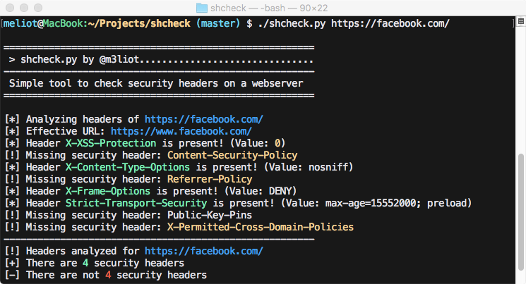

# shcheck - Security Header Check

<p align="center">
    <a href="https://pypi.org/project/shcheck/"></a>
    <a href="https://pypi.org/project/shcheck/"></a>
    <a href="#"></a>
    
</p>

## Check security headers on a target website

I did this tool to help me to check which security headers are enabled on certain websites.

The tool is very simple and it's the result of few minutes of coding.

It just check headers and print a report about which are enabled and which not

I think there is a lot to improve, and I will be grateful if somebody wants to help

## How to run:

### Pypi
```bash
pip3 install shcheck
shcheck.py https://insecurity.blog
```

### Docker
First build your docker container using something like this: 

`docker build -t shcheck .`

Then simply run your docker container using something like this where you specify which website you want to check headers on: 

`docker run -it --rm shcheck https://insecurity.blog`

### From source
```bash
git clone https://github.com/santoru/shcheck && cd shcheck
./shcheck.py https://insecurity.blog
```

### Standalone script
If you want to run shcheck as a standalone script, just grab the `shcheck.py` script from the `shcheck` module/folder and copy it around.

## Usage
```
Usage: ./shcheck.py [options] <target>

Options:
  -h, --help            show this help message and exit
  -p PORT, --port=PORT  Set a custom port to connect to
  -c COOKIE_STRING, --cookie=COOKIE_STRING
                        Set cookies for the request
  -a HEADER_STRING, --add-header=HEADER_STRING
                        Add headers for the request e.g. 'Header: value'
  -d, --disable-ssl-check
                        Disable SSL/TLS certificate validation
  -g, --use-get-method  Use GET method instead HEAD method
  -j, --json-output     Print the output in JSON format
  -i, --information     Display information headers
  -x, --caching         Display caching headers
  -k, --deprecated      Display deprecated headers
  --proxy=PROXY_URL     Set a proxy (Ex: http://127.0.0.1:8080)
  --hfile=PATH_TO_FILE  Load a list of hosts from a flat file
  --colours=COLOURS     Set up a colour profile [dark/light/none]
  --colors=COLOURS      Alias for colours for US English
```
